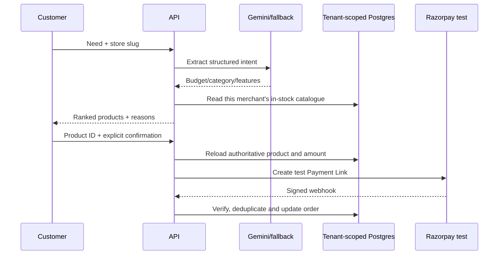

# LocalShop AI — Architecture and Production Guide

## 1. Product model

LocalShop AI is used by both sides of a retail transaction:

1. A **customer** opens a merchant storefront, describes a need, receives
   catalogue-grounded recommendations, selects a product and explicitly
   confirms checkout.
2. A **retailer team** manages products, inventory, orders, insights, staff and
   the audit trail in an authenticated workspace.
3. A **platform administrator** onboards and governs merchant tenants.

The real-world problem is guided product discovery for small retailers that
cannot provide a human sales assistant in every customer conversation.

## 2. Trust boundary



The AI is an interpretation component, not an execution authority. It cannot
invent catalogue items, alter stock, set prices or create a payment by itself.

## 3. Tenant and identity architecture

Hosted identity is read from verified `oai-authenticated-user-*` request
headers. Local development uses `DEV_USER_EMAIL` and `DEV_USER_NAME`. Identity
resolution occurs only on protected merchant/admin routes; public storefront
requests resolve a store slug without provisioning a staff account.

The first authenticated identity in a new owner-restricted deployment
bootstraps the demo tenant owner and platform administrator. For a broader
deployment, set `PLATFORM_ADMIN_EMAILS` before opening access and provision
public customer identity through a managed provider at the edge.

### Roles and permissions

| Role | Catalogue | Inventory | Orders | Insights/audit | Staff |
|---|---|---|---|---|---|
| Owner | Write | Write | Read/write | Read | Manage |
| Merchant admin | Write | Write | Read/write | Read | Manage |
| Manager | No product-definition edits | Write | Read/write | Read | No |
| Sales agent | No | No | Read | No | No |
| Platform admin | Tenant governance | — | — | — | — |

Owner memberships are protected from staff-status edits. Invited users activate
their membership only when the verified sign-in email matches the invitation.

### Tenant isolation rule

`products`, `shopping_sessions`, `checkout_events` and `audit_events` include a
`merchant_id`. Protected data functions receive the actor's server-resolved
tenant ID and include it in reads and writes. Public endpoints accept a store
slug, resolve it to an active merchant on the server, and do not accept an
arbitrary tenant ID.

## 4. Database model

| Table | Purpose |
|---|---|
| `merchants` | Tenant name, unique storefront slug and active/suspended state |
| `users` | Verified staff/platform identities and last-seen time |
| `memberships` | User/email-to-merchant role and invitation state |
| `products` | Tenant catalogue, price, stock, rating and search tags |
| `shopping_sessions` | Customer request, structured intent and engine |
| `checkout_events` | Order number, authoritative amount, provider and status |
| `audit_events` | AI, catalogue, inventory, staff, order and payment evidence |

Prisma schema lives in `prisma/schema.prisma`; migrations are under
`prisma/migrations/`. Run `npm run db:migrate` to apply pending migrations.

## 5. Application surfaces

### Customer storefront — `/store/[slug]`

- Loads only the active merchant's catalogue.
- Accepts natural-language need and optional email.
- Displays extracted intent, ranked products and match reasons.
- Requires product selection plus explicit confirmation.
- Returns a safe simulation or Razorpay test link with an order number.

### Merchant workspace — `/`

- **Sales agent:** assisted recommendation and checkout flow.
- **Catalogue:** product creation and stock adjustment.
- **Orders:** provider/status queue and fulfil/cancel operations.
- **Insights:** products, stock risk, sessions, orders and revenue intent.
- **Audit:** explainable operational/AI/payment event timeline.
- **Staff:** invitation plus activation/suspension for authorized roles.

### Platform admin — `/admin`

- Create a merchant and invited owner.
- View storefront URLs and membership counts.
- Activate or suspend a merchant.
- A suspended merchant cannot be resolved by its public store slug.

## 6. API surface

| Method | Route | Access |
|---|---|---|
| GET | `/api/catalog?store=:slug` | Storefront |
| POST | `/api/recommend` | Storefront or merchant |
| POST | `/api/checkout` | Storefront or merchant; confirmation required |
| GET/POST | `/api/catalog` | Merchant; write requires owner/admin |
| PATCH | `/api/catalog/:id` | Tenant-scoped catalogue/inventory permission |
| GET/PATCH | `/api/orders` | Tenant-scoped order permission |
| GET | `/api/insights` | Tenant-scoped insights permission |
| GET | `/api/audit` | Tenant-scoped audit permission |
| GET/POST/PATCH | `/api/staff` | Owner or merchant admin |
| GET/POST/PATCH | `/api/admin/merchants` | Platform administrator |
| POST | `/api/webhooks/razorpay` | Valid Razorpay HMAC signature |

## 7. Security controls implemented

- Server-side role checks for protected endpoints.
- Tenant scope derived from verified actor or resolved active store slug.
- Confirmation gate before any payment-link attempt.
- Product and amount reloaded from authoritative server data at checkout.
- Razorpay HMAC-SHA256 verification over the unmodified raw request body.
- Webhook event-ID deduplication and constant-time signature comparison.
- Security headers: CSP, frame denial, MIME sniffing prevention, restrictive
  referrer and permissions policies.
- Environment-based secrets; `.env` and hosting identity are ignored by Git.
- Input format and allowed-status validation at API boundaries.
- Audit records for recommendation, inventory, checkout, order, staff and
  platform-governance actions.

## 8. Failure behavior

- Missing Gemini key: deterministic intent extraction.
- Invalid Gemini output or request failure: deterministic fallback.
- Missing Razorpay test keys: clearly labelled simulation; no real payment.
- Configured Razorpay failure: visible error; never converted to success.
- Suspended merchant: storefront resolution returns not found.

## 9. Source structure

```text
app/
  admin/ + admin-console.tsx       platform administration
  store/[slug]/ + storefront.tsx  customer storefront
  api/                            server endpoints
  localshop-workspace.tsx         merchant workspace
prisma/schema.prisma              Prisma data model
prisma/migrations/                versioned SQL migrations
lib/authz.ts                      identity, roles and tenant governance
lib/product-store.ts              tenant catalogue repository
lib/session-store.ts              shopping-session repository
lib/audit-store.ts                audit/order repository
lib/gemini.ts                     structured intent extraction
worker/index.ts                   security headers middleware
tests/                            production-render smoke test
```

## 10. Go-live checklist

The code is a production-oriented MVP. A real commercial launch still needs:

- managed public customer authentication/session lifecycle;
- transactional email for invitations and order communication;
- per-merchant Razorpay onboarding, key custody and live-mode approval;
- Cloudflare WAF/rate limiting, bot protection and abuse monitoring;
- migration CI, backups, restore drills and data-retention jobs;
- centralized logs, tracing, alerts and error reporting;
- dependency/security scanning, penetration and load testing;
- privacy policy, terms, consent, deletion/export and regional compliance;
- accessible product content and full cross-browser/device QA.

These are deployment and organizational controls; no repository can safely
preconfigure them without your accounts, legal requirements and production
domain.
