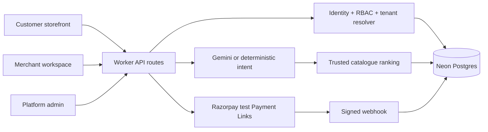

# LocalShop AI

LocalShop AI is a production-oriented, multi-tenant agentic-commerce platform
for small retailers. Customers describe what they need in natural language;
the backend extracts structured intent, ranks only real in-stock products, and
creates a Razorpay **test** checkout only after explicit confirmation.

The same application includes three experiences:

- Customer storefront: `/store/nova-store`
- Merchant workspace: `/`
- Platform administration: `/admin`

## What it solves

Small retailers lose sales because customers describe a problem or budget—not
an exact product name. LocalShop AI shortens the journey from “I need wireless
headphones under ₹2,000 for online classes” to an explainable recommendation
and confirmation-gated checkout. Retailers control catalogue truth, stock,
orders, staff roles and audit history.

## Working capabilities

- Multiple isolated merchant tenants and customer storefront slugs.
- Platform-admin merchant onboarding, activation and suspension.
- Merchant owner, admin, manager and sales-agent roles.
- Email-based staff invitations, activation and suspension.
- Durable Postgres tables (Neon) for tenants, identities, memberships, products,
  sessions, orders and audit events.
- Gemini structured intent extraction with a deterministic offline fallback.
- Server-side product ranking; the AI never controls price, stock or payment.
- Confirmation-gated Razorpay test Payment Links and verified webhooks.
- Catalogue, inventory, orders, insights, audit and integration dashboards.
- Security headers, server-side authorization and tenant-scoped queries.
- Local safe mode: no paid credentials are required to demonstrate the flow.

## Architecture



Every merchant-owned row carries a `merchant_id`, and backend queries include
that tenant identifier. Browser-provided prices and merchant IDs are never
trusted for protected operations.

## Technology stack

| Layer | Technology |
|---|---|
| UI | React 19, TypeScript, responsive CSS |
| App framework | Vinext/Next-compatible App Router, Vite |
| Runtime | Node.js / Vite (vinext) |
| Database | Neon Postgres, Prisma ORM |
| AI | Gemini structured output + deterministic fallback |
| Payments | Razorpay Payment Links in test mode + HMAC webhooks |
| Identity | Verified hosted identity headers; local development identity |

## Quick start on Windows PowerShell

Requirements: Node.js 22.13+ and npm, plus a Neon Postgres database.

```powershell
cd D:\Projects\LocalShop-AI
npm install
Copy-Item .env.example .env
# Edit .env and set DATABASE_URL to your Neon connection string
npm run db:migrate
npm run dev:portable
```

Open the URL printed by Vite (normally `http://localhost:3000`).

macOS/Linux equivalents:

```bash
npm install
cp .env.example .env
# Edit .env and set DATABASE_URL to your Neon connection string
npm run db:migrate
npm run dev:portable
```

The local identity in `.env.example` becomes the initial Nova Store owner and
platform administrator. Change `DEV_USER_EMAIL` to test an invited staff user.

## Optional integrations

The app works without external keys. Add these only in a private `.env` file:

```env
DATABASE_URL=postgresql://...
DIRECT_DATABASE_URL=postgresql://...
GEMINI_API_KEY=
GEMINI_MODEL=gemini-3.7-flash
RAZORPAY_KEY_ID=rzp_test_xxx
RAZORPAY_KEY_SECRET=
RAZORPAY_WEBHOOK_SECRET=
PLATFORM_ADMIN_EMAILS=verified-admin@example.com
```

Never commit `.env` or live-mode payment credentials.

## Verification commands

```bash
npm run typecheck
npm run build:portable
npm run check
```

## Documentation

- [PROJECT_GUIDE.md](./PROJECT_GUIDE.md) — architecture, roles, database,
  workflows, security and go-live checklist.
- [INSTALLATION.md](./INSTALLATION.md) — Windows/macOS/Linux setup,
  credentials, verification and deployment.
- [SUBMISSION.md](./SUBMISSION.md) — objectives, technical challenges and
  five-minute buildathon pitch script.

## Production boundary

This repository is a deployable production-oriented reference implementation,
not a claim of regulatory certification. Before accepting real customers or
money, connect managed public authentication and transactional email, provision
per-merchant payment onboarding, add edge rate limiting/WAF policies, complete
privacy and retention work, run security/load tests, and obtain Razorpay live
approval. The included payment path is intentionally test-mode-first.
